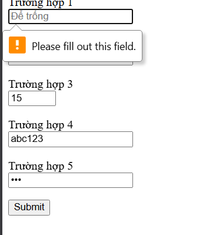
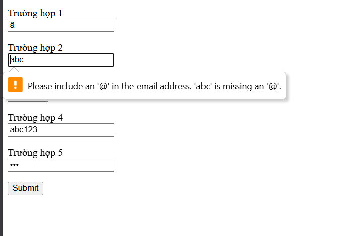

# Câu A1 — Input Types

1. `type="email"` → Ô nhập text, tự kiểm tra định dạng email có ký tự `@` → Dùng cho ô email đăng ký
2. `type="tel"` → Ô nhập số điện thoại → Không tự validate chặt, thường kết hợp `pattern` → Dùng cho SĐT giao hàng
3. `type="password"` → Ô nhập mật khẩu, ký tự bị ẩn → Không hiển thị nội dung → Dùng cho mật khẩu tài khoản
4. `type="date"` → Bộ chọn ngày → Có thể kiểm tra min/max → Dùng cho ngày sinh, ngày giao hàng
5. `type="number"` → Ô nhập số với nút tăng/giảm → Kiểm tra số hợp lệ, min/max/step → Dùng cho số lượng sản phẩm
6. `type="radio"` → Nút chọn một trong nhiều phương án → Chỉ chọn 1 trong nhóm cùng name → Dùng cho giới tính, phương thức thanh toán
7. `type="checkbox"` → Ô chọn bật/tắt → Có thể bắt buộc `required` → Dùng cho đồng ý điều khoản
8. `type="range"` → Thanh kéo giá trị → Giới hạn theo min/max/step → Dùng cho chọn mức đánh giá, số ngày giao hàng
9. `type="file"` → Ô chọn tệp từ máy → Có thể giới hạn `accept` → Dùng cho upload avatar, ảnh CCCD
10. `type="search"` → Ô nhập tìm kiếm → Giao diện tối ưu cho search → Dùng cho tìm sản phẩm

---

# Câu A2 — Validation Attributes

1. `required` + giá trị rỗng → Không cho submit, báo trường bắt buộc.
2. `type="email" value="abc"` → Không hợp lệ vì không đúng format email.
3. `type="number" min="1" max="10" value="15"` → Không hợp lệ vì vượt quá max.
4. `pattern="[0-9]{10}" value="abc123"` → Không hợp lệ vì không khớp pattern 10 chữ số.
5. `minlength="8" value="123"` → Không hợp lệ vì mật khẩu quá ngắn.

### ảnh validation




---

# Câu A3 — Accessibility

1. `<label for="email">` quan trọng vì screen reader đọc đúng nhãn của ô nhập, và người dùng click vào label cũng focus vào input tương ứng.
2. `<fieldset>` + `<legend>` dùng để nhóm các trường liên quan, ví dụ nhóm “Thông tin cá nhân” trong form đăng ký.
3. `aria-label` dùng khi phần tử không có text mô tả nhìn thấy được, ví dụ nút icon chỉ có biểu tượng. Không nên dùng `aria-label` khi đã có `<label>` vì dễ gây trùng nghĩa hoặc che mất nhãn thật, làm giảm accessibility và bảo trì khó hơn.

---

# Câu A4 — Media

1. `loading="lazy"` trên `` giúp trì hoãn tải ảnh cho đến khi ảnh gần vào vùng nhìn thấy, giảm tải ban đầu và cải thiện tốc độ. Không nên dùng cho ảnh quan trọng ở ngay đầu trang hoặc ảnh hero cần hiển thị ngay.
2. Nên cung cấp nhiều `<source>` trong `<video>` để tăng khả năng tương thích trình duyệt. Ba format phổ biến: `mp4`, `webm`, `ogg`.
3. `alt` dùng để mô tả nội dung ảnh cho người dùng khi ảnh lỗi, cho screen reader và cho SEO.

Ví dụ `alt` tốt:

- Ảnh sản phẩm iPhone 16 → `alt="iPhone 16 màu đen, chụp góc nghiêng mặt trước"`
- Ảnh trang trí → `alt=""` để bỏ qua với ảnh decorative
- Ảnh biểu đồ doanh thu Q1/2026 → `alt="Biểu đồ doanh thu quý 1 năm 2026 tăng từ 120 đến 180 tỷ đồng"`

---

# Câu A5 — `<figure>` vs ``

## Khi nào dùng Cách 1?

Dùng `` đơn lẻ khi ảnh chỉ là một phần minh hoạ ngắn, không cần chú thích riêng.

Ví dụ:
- Ảnh avatar người dùng
- Ảnh icon thanh toán

## Khi nào dùng Cách 2?

Dùng `<figure>` + `<figcaption>` khi ảnh và chú thích đi cùng nhau như một đơn vị nội dung.

Ví dụ:
- Ảnh sản phẩm kèm giá
- Ảnh biểu đồ kèm ghi chú dữ liệu

---

# Câu C1 — Debug Form

Lỗi 1: Input “Tên” không có `<label for="...">`, vi phạm accessibility.

Sửa:
```html
<label for="name">Tên:</label>
<input type="text" id="name" name="name" required placeholder="Nhập tên của bạn">
```

Lỗi 2: Input email thiếu `label`, thiếu `name`, thiếu `required`.

Sửa:
```html
<label for="email">Email:</label>
<input type="email" id="email" name="email" required placeholder="Email của bạn">
```

Lỗi 3: Mật khẩu chưa có `label`, `name`, `minlength` và `required`.

Sửa:
```html
<label for="password">Mật khẩu:</label>
<input type="password" id="password" name="password" required minlength="8" placeholder="Mật khẩu">
```

Lỗi 4: Ô nhập lại mật khẩu chưa có `label` và HTML không thể tự kiểm tra khớp với mật khẩu trước.

Sửa:
```html
<label for="confirm-password">Nhập lại mật khẩu:</label>
<input type="password" id="confirm-password" name="confirm-password" required minlength="8" placeholder="Nhập lại mật khẩu">
```

Lỗi 5: Phone dùng `type="text"` với `value` cố định, thiếu label, thiếu `pattern`, thiếu `name`.

Sửa:
```html
<label for="phone">Phone:</label>
<input type="tel" id="phone" name="phone" pattern="[0-9]{10}" placeholder="0901234567" required>
```

Lỗi 6: `<select>` chưa có label và không có `name`.

Sửa:
```html
<label for="city">Thành phố:</label>
<select id="city" name="city" required>
  <option value="">-- Chọn thành phố --</option>
  <option value="hn">Hà Nội</option>
  <option value="hcm">TP.HCM</option>
</select>
```

Lỗi 7: Điều khoản chỉ có `<label>` rỗng, chưa có checkbox để người dùng tick.

Sửa:
```html
<label for="agree">
  <input type="checkbox" id="agree" name="agree" required>
  Tôi đồng ý điều khoản
</label>
```

Lỗi 8: Nút submit ổn, nhưng form nên có `action`, `method` và các trường nên có `name` để gửi dữ liệu đúng.

Sửa:
```html
<form action="#" method="POST">
```

---

# Câu C2 — Chiến lược Validation

1. Pattern regex:

- CMND/CCCD 12 chữ số: `pattern="[0-9]{12}"`
- Số tài khoản 10–15 chữ số: `pattern="[0-9]{10,15}"`

2. HTML5 validation **không đủ an toàn** cho ngân hàng số vì chỉ chạy ở frontend, người dùng có thể tắt JS, sửa HTML, hoặc gửi request trực tiếp. Phải validate lại ở backend.

3. 3 loại validation HTML5 không thể làm tốt:

- So sánh 2 ô nhập với nhau, ví dụ xác nhận mật khẩu
- Kiểm tra dữ liệu có tồn tại trong database, ví dụ số tài khoản đã đăng ký chưa
- Kiểm tra logic nghiệp vụ hoặc API, ví dụ OTP đúng hạn, số dư đủ, PIN đã bị khóa chưa

4. 2 rủi ro nếu chỉ validate frontend:

- Dữ liệu sai hoặc độc hại có thể đi thẳng vào hệ thống
- Kẻ xấu có thể bypass validation và khai thác API/backend bằng request giả

---
